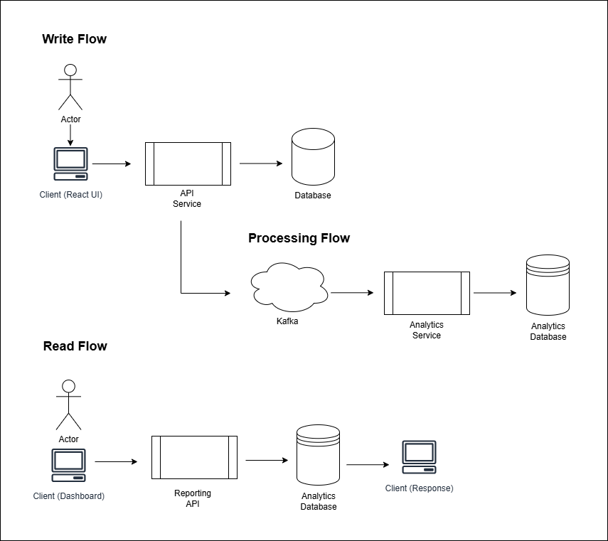

# baby-trackr-service

## Overview
This application is an event driven time-series tracking system with real-time analytics and observability.

### Goal
Whether you’re a first time parent or an experienced caregiver, keeping track of a baby’s schedule can be overwhelming, time consuming, and difficult to manage. From feedings and diaper changes to sleep patterns, maintaining consistency and visibility throughout the day is essential but often challenging.

The goal of this project is to build a data driven event tracking system with real-time analytics that helps caregivers log and monitor essential baby activities such as feeding, diaper changes, and sleep patterns. This application will allow caregivers visibility into daily, weekly, and monthly patterns so they can make informed decisions with confidence.

### Motivation
What problem does this solve? What is the impact if we do not solve it?
As a first time mother, I understand how easy it is to lose track of time, routines, and even personal well-being while caring for a newborn. The lack of structure and visibility can lead to stress, uncertainty, and mental fatigue (especially when sleep deprived).

I want peace of mind not only for myself, but for others who are navigating taking care of tiny human beings. This application is designed to make it easier to track and review a baby’s activities. By sharing insights and discovering patterns over time, the system helps caregivers stay organized and focused on care rather than constantly trying to remember what happened and when.

Without a solution like this caregivers risk missed feedings, inconsistent routines and increased stress, all of which can impact the caregiver’s mental health and the baby’s development.

## System Design

### High Level Design

At a high level, the design of the system can be categorized into 3 separate flows:
Write, Process, and Read.

<b>Write</b> 
Actor → Client → API Service → Service Database
A user (actor) writes to the client to log an event. The client is responsible for interacting with the API service that handles the CRUD operation for events. The service handles the creation, read, update, and deletion in the database. In parallel, it publishes the event to Kafka in real time.

<b>Process</b> 
Kafka → Analytics Service → Analytics Database
After the event is logged by the actor, and published to a Kafka topic. Kafka consumes the event and processes it by performing the necessary data aggregations (daily, weekly, monthly summaries...etc.). This aggregated data is then stored in the analytics database.

<b>Read</b> 
Actor → Client (Dashboard) → Reporting API → Analytics Database → Client Response
To view the data in real time, the user (actor) interacts directly with the dashboard interface (Client Dashboard). The client requests calls from the Reporting API that retrieves the aggregated data stored in the analytics database. The data is returned in a response back to the client.

## Implementation Plan
#### Database Design
Service Database
Entities: Baby, Event, Events Table
Analytics Database

#### Architecture Design
This project follows Clean Architecture design.

#### Other Considerations
This project will use a Gradle build for its build. I will use springboot for the framework.

#### Deployment
Docker

#### API Documentation
Swagger UI

## Observability

Prometheus, Grafana

## Phase 2
Phase 2 of this project implements an AI powered assistant to generate insights by gathering user behavioral data. This phase is out of scope for phase 1, but will be a fast followup following completion of Phase 1.